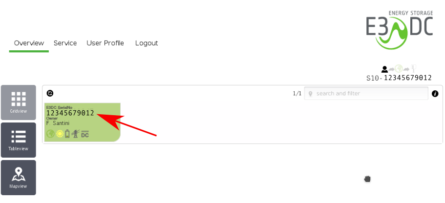

# python-e3dc

**NOTE: This branch is now for python3 and it has a different API than the old python2.7**

Python API for querying E3/DC systems, either through the manufacturer's portal or directly via RSCP connection

This library provides an interface to query an E3/DC solar power management system through the web interface of the manufacturer.

In order to use it you need (web connection):
- Your user name
- Your password
- The serial number of the system which can be found when logging into the E3/DC webpage:
  

Alternatively, for a local connection, you need:
- Your user name
- Your password
- The IP address of the E3/DC system
- The encryption key as set under the preferences of the system.

## Installation

This package can be installed from pip:

`pip install pye3dc`

## Usage

An example script using the library is the following:
```python
from e3dc import E3DC

TCP_IP = '192.168.1.57'
USERNAME = 'test@test.com'
PASS = 'MySecurePassword'
KEY = 'abc123'
SERIALNUMBER = '1234567890'

print("web connection")
e3dc = E3DC(E3DC.CONNECT_WEB, username=USERNAME, password=PASS, serialNumber = SERIALNUMBER, isPasswordMd5=False)
# connect to the portal and poll the status. This might raise an exception in case of failed login. This operation is performed with Ajax
print(e3dc.poll())
# Poll the status of the switches using a remote RSCP connection via websockets
# return value is in the format {'id': switchID, 'type': switchType, 'name': switchName, 'status': switchStatus}
print(e3dc.poll_switches())

print("local connection")
e3dc = E3DC(E3DC.CONNECT_LOCAL, username=USERNAME, password=PASS, ipAddress = TCP_IP, key = KEY)
# The following connections are performed through the RSCP interface
print(e3dc.poll())
print(e3dc.poll_switches())
```

## poll() return values

Poll returns a dictionary like the following:
```python
{
	'consumption': {'battery': 470, 'house': 477, 'wallbox': 0}, # consumption in W. Positive values are exiting the system
	'production': {'grid': -4, 'solar': 951}, # production in W. Positive values are entering the system
	'stateOfCharge' : 77, # battery charge status in %
	'sysStatus': '2623', # status
	'time': datetime.datetime(2017, 8, 14, 7, 6, 13) # timestamp of the poll
} 
```

## Setting swiches

The e3dcObj.set_switch_onoff(switchID, value, keepAlive = False) method sets a smart switch on or off, where value is a boolean and True = on, False = off.
The switchID is a number returned by the poll_switches method. This method only supports on/off switches and not dimmers or motors.

## Note: The RSCP interface

The switch statuses are obtained and manipulated via a rather complicated protocol, called by E3/DC RSCP. This protocol is binary and based on websockets.

The E3DC object automatically connects to the websocket and authenticates. Both the poll_switches and set_switch_onoff methods accept an optional keepAlive parameter.

If keepAlive is false, the websocket connection is closed after the command. This makes sense because these requests are not meant to be made as often as the status requests, however, if keepAlive is True, the connection is left open and kept alive in the background in a separate thread.

## Known limitations

One limitation of the package concerns the implemented RSCP methods. At the moment, only switch status requests and setting of on/off switches is implemented. I also lack the hardware to test different configurations. However, the RSCP protocol is (to my knowledge) fully implemented and it should be easy to extend the requests to other cases.

# Copyright notice

The Rijndael algorithm comes from the python-cryptoplus package by Philippe Teuwen (https://github.com/doegox/python-cryptoplus) and distributed under a MIT license.
